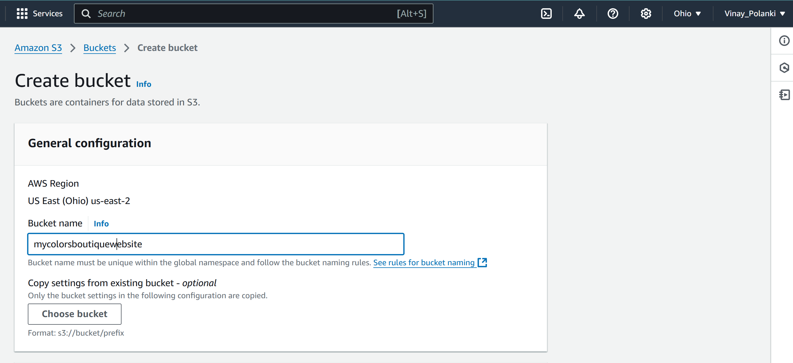
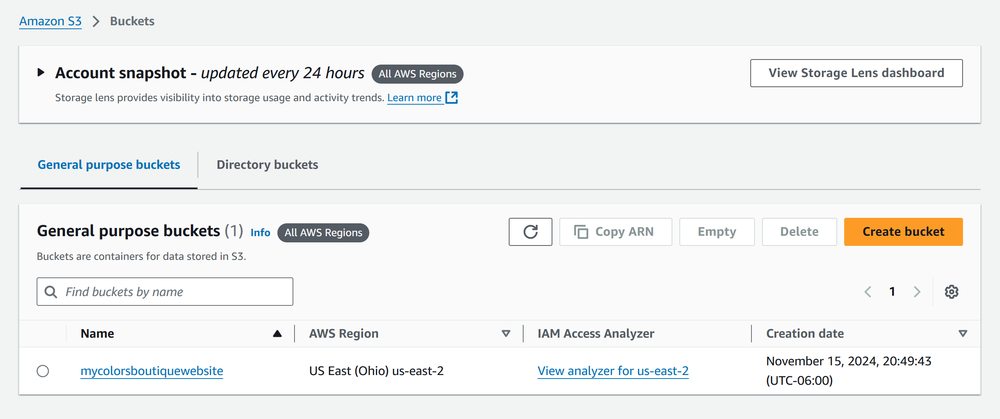
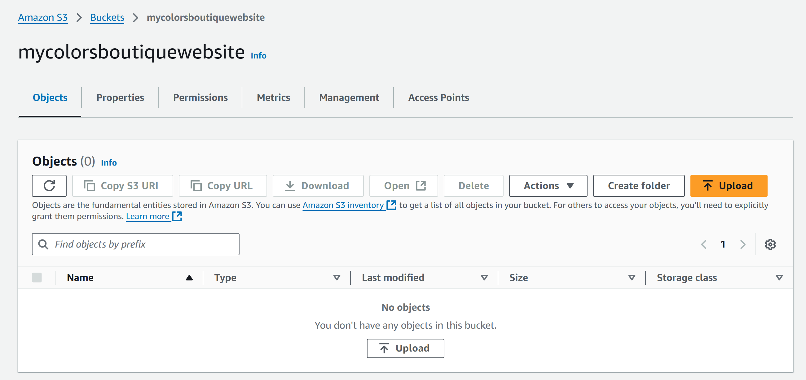
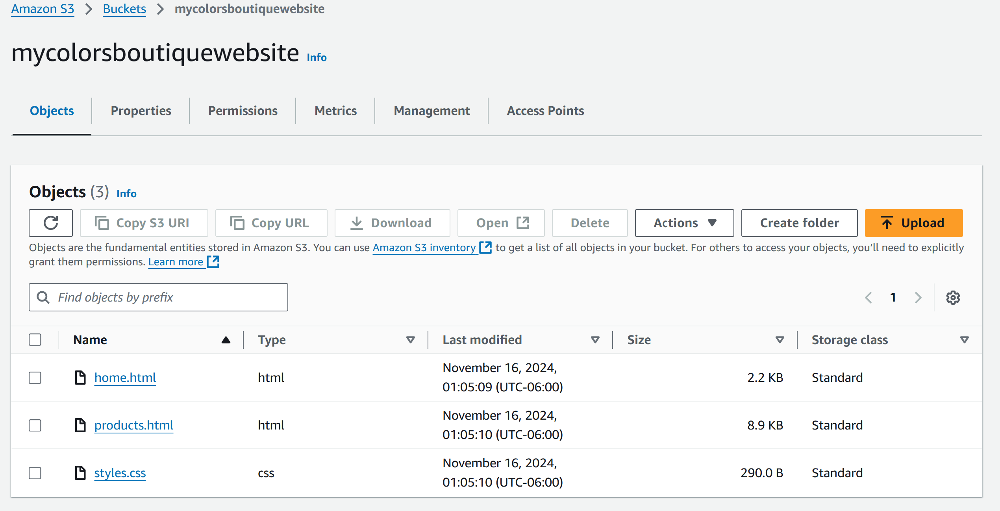
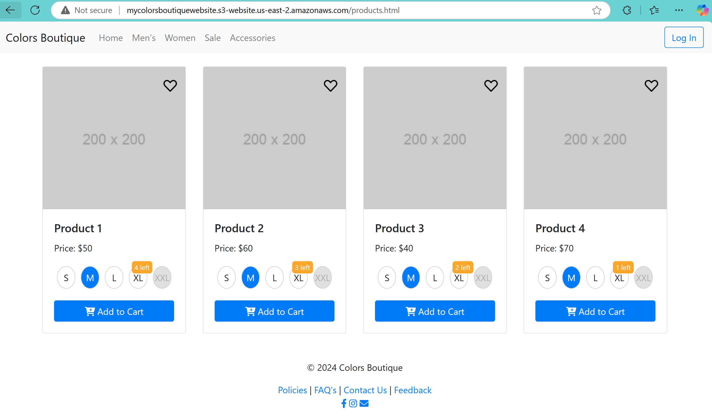

# Static_WEB_Page_Hosting_from_AWS_S3

## Project Overview

This project showcases a simple static website for colors boutique, which is built and hosted on Amazon Web Services (AWS) S3.  It demonstrate my ability to:

- Design user interface using design templates.
- Code HTML and CSS for webpages structure and styling.
- Utilizing cloud services like AWS S3 for website hosting.

## Project Goals:

- Gain  practical experience in building and deploying a static website.
- enhance skills in HTML and CSS.
- Learn AWS S3 functionalities for website hosting.

## Development Process:

1. Website Design: Design templates were used to create the visual layout for the colors boutique website.

2. Content Planning: a PowerPoint outline was created to plan the website structure, content organization and page flow.

3. AWS S3 Setup: A S3 bucket was created with the unique name; all the website files are stored in the bucket including HTML AND CSS along with any images if available (In my case I haven't Uploaded any images but I left the space for the image in both home.html and prodcuts.html pages)
   

4. Public Access Configuration: The S3 bucket was made public by assigning IPv4 address for temporary access.

.

.

.

5. Website Deployment: All the websites files were uploaded to the S3 bucket for public access.

   .

6. Public Access removal: Once I hosted the page and deployed; I took screen shots of each step and web pages. Once, I deleted all the content in my S3 bucket (mycolorsboutiquewebsite.S3 Bucket) and the bucket. It because I use AWS free tier account.

## Project Outcomes:

- ** Functional static website for colors Boutique hosted on AWS S3 ** (http://mycolorsboutiquewebsite.s3-website.us-east-2.amazonaws.com/home.html#).
- Improved skills in HTML and CSS for web designing.
- Gained experience with cloud-based website using AWS S3.

## Future Considerations:

- implement additional functionalities using Python (Beautiful Soup).
- Integrate a custom domain name for the website using Route 53 in AWS when complete extra pages for the website is fully implemented.
- Improve website security and performance.

**Please note**: 
All images for the website was in images folder.
